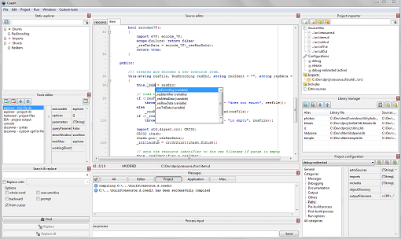
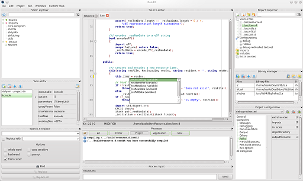
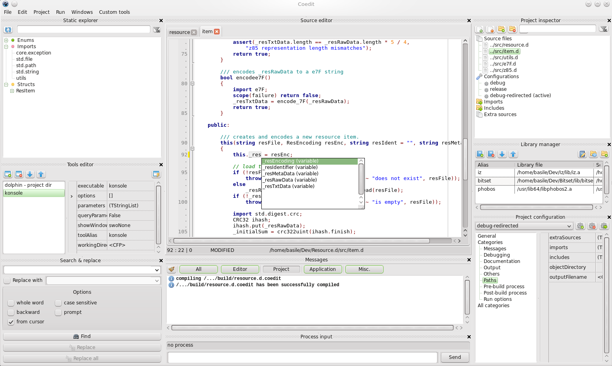

Coedit
======

Coedit is a simple IDE for the [D2](http://dlang.org) lang. (**Co** mpile & **Edit**).

 

Features
--------
- multi platform (Win/Linux).
- strictly based on *DMD* (the alternative compilers are not supported).
- full featured project format and advanced project editor.
- compile and run directly from the UI.
- compile and execute an unsaved module with a single click.
- compile and _unittest_ a module with a single click.
- synchronized edition in a block.
- D2 syntax highlighter, folding, identifier markup.
- symbol list of the module being edited.
- static libraries manager.
- search and replace.
- _todo comments_ analyzer.
- user-defined tools powered by a string interpolation system (in a single click: submit the current module to _dfmt_ or _dscanner_, or disassemble the output in IDA !)
- full [D Completion Daemon](https://github.com/Hackerpilot/DCD) integration (completion, hints, call tips, definition finder).
- mini file browser.

Missing things before the first version
---------------------------------------
All the majors features are implemented. 
Some minor things are still missing or not fully working: 
- editor context menu.

Project information
-------------------
- status: beta 2.
- license: MIT.
- programmed in Object Pascal with [Lazarus & FPC](http://www.lazarus.freepascal.org) as IDE & compiler.

Setup or build
--------------
Windows and Linux binaries are available for each release.
The latest Coedit development version must be build from the sources.

The procedure is described in the [**first section of the wiki**](https://github.com/BBasile/Coedit/wiki#detailed-setup-procedure)

GUI preview
-----------
Windows version (Windows 7, x86):

Linux version (OpenSuse 13.2, Kde, x86_64):
